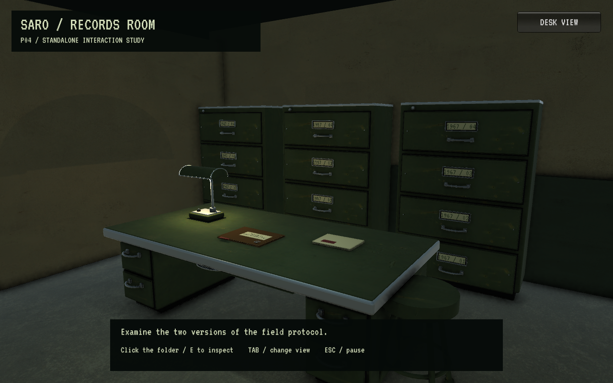

# Archive17 — Blender-pass på arkivprøven

Fem originale modeller erstatter blokkgeometrien i Archive16: arbeidsbord med skuffeseksjoner, fire-skuffers arkivskap, arbeidslampe med buet metallskjerm, saksmappe og papirbunke. Dette er en modelloppgradering av den selvstendige P04-prøven. Spillerhandlingen er fortsatt å åpne mappen, sammenligne to protokoller og velge en konklusjon som dokumentene støtter.

Arbeidet bygger på faktisk flettet PR11, `f2d92a7a8cc770849346221751a752831b6b2637`. Den etablerte grønne stål-/papirpaletten og de samme inspeksjonskameraene er videreført. Skuffer og lampe er statiske rekvisitter. Prøven har fortsatt to kamerastillinger og ingen lagring eller fri gange.

## Faktisk resultat

[Før: Archive16 i Unity](../Archive16/Evidence/02-room.png) · [Etter: nytt modellpass i Unity](Evidence/02-room.png) · [Nærbilde i Unity](Evidence/01-desk.png)



Disse bildene er originale, uendrede skjermfangster fra den utpakkede Linux-spilleren i 1280×800. De er tatt gjennom API-styrte scenarier og dokumenterer ikke en test med fysisk mus eller tastatur.

[Blender-oversikt](Evidence/furniture-authoring.png), [bakside](Evidence/rear-authoring.png) og [detaljer](Evidence/desk-detail-authoring.png) er authoring-renderinger med nøytral studiobelysning. De er ikke spillbilder eller genererte konsepter.

## Modeller og gjenbruk

| Modell | Synlig forbedring | Trekanter | Mesh-renderere per modell |
| --- | --- | ---: | ---: |
| Arbeidsbord | Avrundet stålramme, egen skriveflate, to skuffeseksjoner, kneåpning, buede håndtak og sokler | 7 568 | 3 |
| Arkivskap | Pressede fronter, skuffesprekker, etikettlommer, håndtak, nagler og lås | 12 256 | 4 |
| Arbeidslampe | Hul buet skjerm med lukkede ender, lysrør, bøyd stativ, bryter og kort kabel | 6 500 | 4 |
| Saksmappe | Separate ark, lett løftet omslag, fals, metallfester og rød indeksflik | 3 036 | 5 |
| Papirbunke | Tolv forskjøvne ark og rød arkivslipp | 2 444 | 2 |

Tre skap brukes i scenen. De nye modellene utgjør derfor 56 316 trekanter og 26 mesh-renderere i denne plasseringen; dette er geometritelling, ikke en FPS- eller draw-call-måling. Eksisterende stol, rom, tekst og UI kommer i tillegg. Materialgrupper er slått sammen for å unngå én renderer per skrue og beslag. Mappens navngitte etikettmesh beholdes for plassering av lesbar tekst.

Redigerbar kilde: [SIGNAL47_archive17_furniture.blend](../../Unity/Blender/SIGNAL47_archive17_furniture.blend). Reproduserbar oppskrift: [archive17_furniture.py](../../Unity/Blender/Source/archive17_furniture.py). Fem FBX-filer og [kildemanifest](../../Unity/Assets/Signal47/Art/Archive17/source-manifest.json) ligger under `Unity/Assets/Signal47/Art/Archive17/`. Blender bruker meter; Unity-byggeren bevarer importrotasjonene under en plasseringsrot og kontrollerer dimensjonene etter aksekonvertering.

Geometrien er laget for dette prosjektet uten eksterne modeller. Unity gjenbruker Chapter09-materialer og teksturer med eksisterende [lisenskreditering](../THIRD_PARTY_NOTICES.md). De eldre modellene er bevart. Magnifics tilkoblede verktøykatalog tilbyr bilde-til-3D med GLB-utdata, men ingen Magnific-generering eller kredittbruk er utført i dette passet. Presise møbler ble laget direkte i Blender. En generert organisk rekvisitt kan vurderes når historien faktisk krever en slik.

## Gauntlet: feil, retting og kontroll

Akseptkriteriene var tydeligere silhuetter/beslag fra eksisterende kamera, riktige mål og materialer etter import, lesbar mappe, fortsatt fungerende P04-interaksjon og en kontrollerbar separat pakke.

Første kjøring bestod 18 API-kontroller, men [spillbildet viste striper i bordplaten](Evidence/iteration1-zfighting.png). Skriveflaten og underlaget hadde sammenfallende toppflater; samme konstruksjonsfeil ga svart topp i Blender-renderingen av skapet. Høydene er nå skilt. Lampens åpne ender viste også et distraherende sterkt lysrør fra siden; endekapper skjuler dette. Sluttbilder fra begge kameraene viser rettingene. Dette er sekvensiell egenkontroll, ikke uavhengig review.

| Kontroll | Status og bevis |
| --- | --- |
| Blender-kjøring, FBX eksport/reimport | PASS, fem modeller; dimensjoner innen 0,00001 m, UV-lag og positive flatearealer |
| Unity-import | PASS, [syv plasserte instanser](Evidence/unity-import.json); mål innen 0,002 m, antall trekanter/renderere, UV-er og normalvektorer |
| Faktisk Linux-bygg | PASS, Unity 6000.3.22f1 / URP, [byggmanifest](Evidence/build-manifest.json) |
| P04-regresjon | PASS, 18 API-kontroller direkte og 18 gjennom launcher i utpakket pakke; [sluttresultat](Evidence/result.json) |
| Visuell kontroll | PASS for dette modellpassets kriterier, begge kameravinkler og åtte dokument-/spillstater i 1280×800 |
| Pakke | PASS, 171 filer, arkiv-/payload-hasher, trygge stier, lagrede filmoduser og nødvendige kjørerettigheter; [rapport](Evidence/extraction.json) |
| Faktisk mus/tastatur, andre oppløsninger | UNVERIFIED; brukerens skrivebord er fortsatt utilgjengelig for native testing |
| Releaseytelse | UNVERIFIED; ingen ny FPS-/frametidsmåling |
| M1-blindtest, P05, komplett arkivkapittel og 5–6 timer | UNVERIFIED / ikke implementert; dette passet endrer ikke historiens omfang |

[Samlet identitet og verifikasjon](Evidence/verification.json) knytter originalbildene til kilde og pakke. Ingen endringer i hovedscenen, hovedspillets lagring, spillerlogikk eller standardstarter inngår.

## Åpne kandidaten

Fra reporoten:

```bash
Artifacts/Releases/Archive16-74eb85f963c7/Start-SIGNAL47.sh
```

Klikk mappen eller trykk E. 1/2 velger dokument; 3 sammenligner etter at begge er besøkt. Tab bytter visning. Escape lukker dokumentet eller åpner pause. Prøven lagrer ikke fremdrift.

Pakken beholder familienavnet Archive16 fordi dette fortsatt er samme selvstendige prøve; Archive17 betegner modellpasset. Lokal flyttbar pakke: `Artifacts/Releases/SIGNAL47-Archive16-74eb85f963c7-Linux.tar.gz`. Pakker under `Artifacts/` følger ikke med et rent Git-klon. `Spill-SIGNAL47.sh` starter fortsatt Visual10.

Rebygg med eksisterende Blender/Unity-installasjon:

```bash
/home/tombonator3000t/signal47-tools/blender-4.5.13-linux-x64/blender --background --python-exit-code 2 --python Unity/Blender/Source/archive17_furniture.py
bash Automation/build-archive16-linux.sh
bash Automation/run-archive16-checks.sh "$PWD/Artifacts/GauntletLinux/Signal47.x86_64"
python3 Automation/package-chapter09.py --label Archive16 --candidate
```

Ny bygging får identitet fra faktisk kildeinnhold. Ikke overskriv en eksisterende pakke med andre bytes. Neste steg er ekte input og en førstegangsleser i denne prøven. Før modellene flyttes til hovedspillets frie gange trengs en avgrenset integrasjon med passende kollisjonsvolumer og måling på målmaskinen; møblenes skuffer er ikke animerte eller interaktive.
