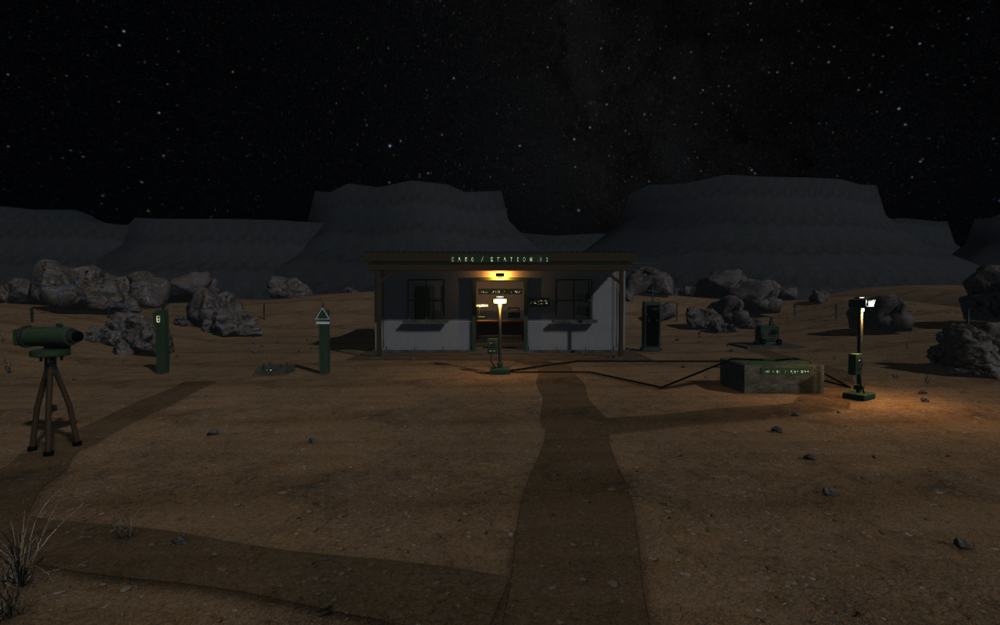

# STATION 01 — miljøpass 27

## Avtalt resultat

En troverdig liten målestasjon i New Mexico, 1986: servicevei og lukket port ved den implisitte ankomsten, gruslagt arbeidsfelt, instrumenter med leselig funksjon, slitt brakke og et terreng som fortsetter bak den. Samme P06–P09-reise og eksisterende lagring beholdes. Dette er miljøproduksjon i hovedspillet; ingen ny motor eller splatprøve.

Forlegg: `Docs/DesignBible13/Visuals/concept-01-survey-station.png` (konsept, ikke spillbilde). Vi viderefører varm arbeidsbelysning mot kjølig ørkennatt, slitt puss og malt metall, steinete terreng og sparsomme tørre planter. Før-bilde: `Docs/Station26/Evidence/Packaged1600/01-arrival.png`.

## Visuell godkjenning

- Ankomst viser flere dybdelag med kantete steinformer, innkjøring og brukbare ganglinjer; ingen synlig firkantet arena eller halvkuler som fjell.
- Port, kabelføringer, fundamenter og vedlikeholdsutstyr forklarer hvordan stedet brukes. Props står på underlaget med korrekte størrelser.
- Nærbilder av transit, kabel og mottaker tåler vanlig spilleravstand. Tekstur og materialforskjeller finnes i den faktiske Unity-visningen.
- Brakka har fysisk innrammede åpninger, arbeidsbenk og innredning. Varmt lys leder spilleren inn, mens lampens av/på-prøve er synlig.
- Samme feltreise med virkelige foto og lagring består. Separat kamerarute måler alle bildetider på Kubuntu-maskinen; ekte tastatur/mus er et eget bevis.

## Arbeid og kontroll

Originale modeller og eksisterende CC0-materialer gjenbrukes med kildespor. Nye originalmodeller lagres med Blender-kilde og FBX. Testsekvenser, kollisjon og materialer kontrolleres i det faktiske bygget før pakking. Standardstarter og eldre prøvepakker bevares.

## Leveransen

13. september 2026: miljøpasset er levert som **Environment27-testkandidat**. Prøv `~/Nedlastinger/Environment27-22a160fafeb3/Start-STATION01.sh` og velg **CONTINUE CHECKPOINT**. Starteren lager en egen vedvarende prøveprofil med den opprinnelige saken og arkivets reisemål fullført; feltoppgavene er uutførte. Den vanlige lagringen berøres ikke. `Start-SIGNAL47.sh` i samme mappe åpner spillets vanlige profil. Visual10 er fortsatt standard.

Terreng og servicevei dekker et større visuelt område rundt samme feltreise. Kantete, fotograferte steiner, tørre planter, gjerde, strømfordeling og vedlikeholdsutstyr forklarer hvordan stedet brukes. Brakka har vindusåpninger, karmer, sålebenker, takdetaljer, arbeidsbenk, mottaker, stol og skap. Originale Blender-modeller erstatter enkle instrumentfigurer. Lokal vind og generatorlyd starter sammen med feltet; SAROs lys og tåke gjenopprettes ved retur.

De første egenlagde steinvariantene så fortsatt avrundede ut i spillet. De er bevart som kilder, mens sluttområdet bruker [Poly Haven Boulder01](https://polyhaven.com/a/boulder_01), Rico Cilliers, CC0, med to bearbeidede detaljnivåer. [Pinnet kildeoppskrift](BoulderSource.json), Blender-kilder, originale teksturer og lisenskreditering følger med. Generatorloopen er en reproduserbar bearbeiding av tidligere hentet CC BY 3.0-lyd; ingen kjøp er gjort.

## Verifikasjon

Den utpakkede versjonen består 168 feltkontroller ved 1600×900, 118 arkivkontroller, 42 kontroller av eksisterende spill og 50 meny-/gjenopprettingskontroller. Testene bruker faktisk Unity-kjøring og spillets API; de er ikke native tastatur/mus. Feltfoto eksporteres som egne JPEG, lagres og framkalles etter retur. Pakkens 179 filer, filrettigheter, fem historiske kildefiler og uendret standardstarter er kontrollert. [Samlet bevis](Evidence/verification.json) og [testgrenser](TEST_PLAN.md).

En 120-sekunders kamerarunde ved 1280×800 / OpenGL / Intel ARL målte **65,80 FPS i snitt**, p95 **20,00 ms**, p99 **22,08 ms**, uten bilder over 50 ms. Samme runde før optimalisering målte 36,89 FPS. Både steiner og gress ble delt i romlige tegnegrupper; alle plasseringer og modeller ble beholdt. Det gir bedre utsiling av ting utenfor kameraet. **Stabile 60 FPS er fortsatt ikke bestått** etter kravet p95 ≤ 16,67 ms og p99 < 20 ms. Målingen er feltets kamerarunde med skjult HUD, ikke hele spillet eller 1600×900-ytelse.

Feltauditen har 150 MeshRenderere og 324 344 trekanter; i tillegg finnes 648 gressinstanser i 164 grupper, totalt 1 510 004 logiske trekanter før utsiling. Rendererauditen alene er derfor ikke total geometrimengde eller målt antall synlige trekanter per bilde.

## Gjenstående arbeid

Dette er et tydelig visuelt løft fra Station26, men bakgrunnsfjell, gangstikanter og enkelte maskindetaljer er fortsatt enkle. Ekte input, blind forståelse/tidsbruk og subjektiv lydmiks gjenstår. Neste konkrete ytelsestiltak er et enklere gressnivå med samme atlas og silhuett; dette skal sammenlignes i spillet før en endring godtas.

Neste samlede innholdsleveranse er oppfølgingen av feltbevisene på SARO og overgangen mot SIERRA MOTOR COURT innen eksisterende verdensdesign. Hele K3 og 5–6-timersspillet er ikke implementert. Produksjonslærdommen fra dette passet er å bruke faktiske spillbilder tidlig, skifte metode når egen geometri ikke gir tilstrekkelig kvalitet, og måle representativt før en penere kandidat blir standard.

Kilde og bevis: [PR23](https://github.com/Tombonator3000/SIGNAL-47/pull/23). Merge er kildelevering og endrer ikke de åpne prøveportene.
