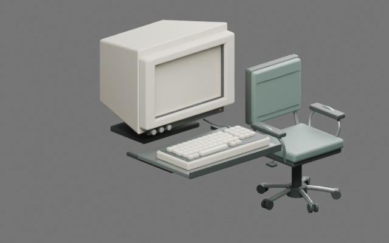

# Blender MCP — vurdering og utprøvd skill

12. september 2026. Brukeren ba om analyse av [bpy-dev/blender-mcp](https://github.com/bpy-dev/blender-mcp) og en gjenbrukbar skill dersom verktøyet er nyttig.

**Anbefaling: bruk som et tillegg til Blender-arbeidet.** Lagrede scener kan inspiseres, endres og rendres gjennom MCP uten å styre skrivebordet. Vi beholder Blender 4.5.13, de originale modelleringsskriptene og Unity/FBX-løpet. Det gir konkret hjelp ved modellkontroll og senere opprydding i eventuelle Magnific-modeller; det er ikke en egen bildegenerator eller automatisk Unity-integrasjon.

Gjennomgangen dekker server/add-on-arkitektur, CLI-eksekvering, API-oppslag, lagring, rendering, avhengigheter, representative tester og benchmarkenes begrensninger. Repoet er en uavhengig utviklingsversjon basert på Blender Lab MCP. Inspisert kilde er commit `e8ac4088d4a3e0469d3eff9f9bb2dd717e899219`. Detaljert vurdering og permanente kildelenker ligger i [skillens vurdering](../../../Automation/Skills/blender-mcp/references/assessment.md).

## Lagret og tatt i bruk

Skillen heter `$blender-mcp` og ligger lokalt i `/home/tombonator3000t/.codex/skills/blender-mcp`. En identisk [versjonert kopi](../../../Automation/Skills/blender-mcp/SKILL.md) følger prosjektet. Den har en original Python-klient som faktisk starter MCP over stdio og begrenser verktøyvalget til lagrede filer og dokumentasjon. Serveren er installert i et separat Python-miljø utenfor spillet. Ingen global MCP-konfigurasjon eller Blender-add-on er endret.

Skillen er brukt til å inspisere en kopi av `SIGNAL47_workstation18.blend`, lagre/gjenåpne en testkopi, rendre og kontrollere FBX-eksport/import. Den inneholder oppsett, kildeanalyse, kjente versjonsbegrensninger og lokal verifikasjon. `game-production` sin lokale art-veiledning peker også på skillen som et valgfritt verktøy.

## Faktiske resultater

| Kontroll | Resultat |
| --- | --- |
| MCP-forbindelse og filoversikt | Består; 11 fil-/dokumentasjonsverktøy oppdaget |
| Modellkontroll | 13 mesh-objekter, 31 732 trekanter; UV-/materialantall og dimensjoner bevart etter lagring/gjenåpning |
| FBX tur-retur | Samme antall mesh/trekanter; dimensjonsavvik under 0,00001 meter |
| Rendering | 640×400, Cycles CPU; faktisk PNG inspisert |
| Originalfil | SHA-256 uendret: `8f8003b54605691ba2403187106fea45be8962d9dfa3305a1846a5476541eca8` |
| Manglende referanser | Egen kontroll via `bpy.utils.blend_paths` består, inkludert bevisst manglende bildefil |
| Kjent inkompatibilitet | Upstreams manglende-filer-verktøy feiler på 4.5.13; generelt FBX-operatøroppslag gir `unsupported` |
| Tilpasset API-oppslag | Funksjonsoppslag og eksplisitt FBX RNA-oppslag består |
| Utvalgte upstream-tester | 91 kjørt: 83 bestått, 7 hoppet over, 1 feil i forventet verktøyliste |

Dette er en **Blender-render**, ikke et nytt spillbilde. CRT-ens levende Unity-skjerm er ikke del av Blender-modellen. Skillen håndterer også at upstreams direkte bildeverktøy krever CUDA/Cycles, mens prøven vår bruker en eksplisitt CPU-render.

[Samlet verifikasjon](Evidence/verification.json), [modell-/filhash](Evidence/summary.json), [tilpasset kontroll og FBX-resultat](Evidence/compatibility.json), [rå upstream-testlogg](Evidence/upstream-tests.log) og [lokal bruksoppskrift](../../../Automation/Skills/blender-mcp/references/local-verification.md) følger med. Feilene er bevart som feil; vellykket MCP-transport betyr ikke at en API faktisk ble funnet.

## Betydning for videre produksjon

Bruk skillen til kontroll av skala, mesh/materialbudsjett, filreferanser og lagrede endringer, samt raske rendringer før Unity-import. Magnific kan fortsatt levere kandidater til denne kontrollen. Benchmarkens CLIP-likhet er ikke dokumentasjon på spillklare modeller, og gir ingen grunn til å bytte motor eller utvide historien.

Ingen Unity-kilder, originale modeller, startere eller spillpakker er endret i dette passet. Workstation18 og Visual10-standardstarteren har samme status som før. Live add-on, standalone bpy, CUDA-verktøy, full upstream-testpakke og nye Unity-/brukerreisekontroller er ikke verifisert. Neste spillarbeid er fortsatt dokumentlesbarhet og avklart kobling til arkivprøven P04.
