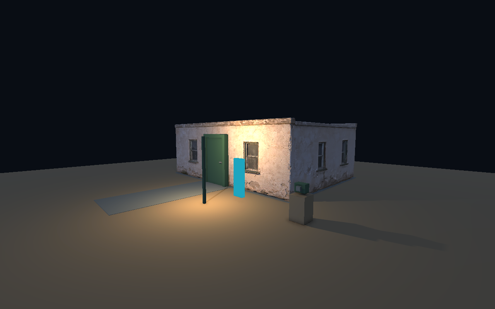
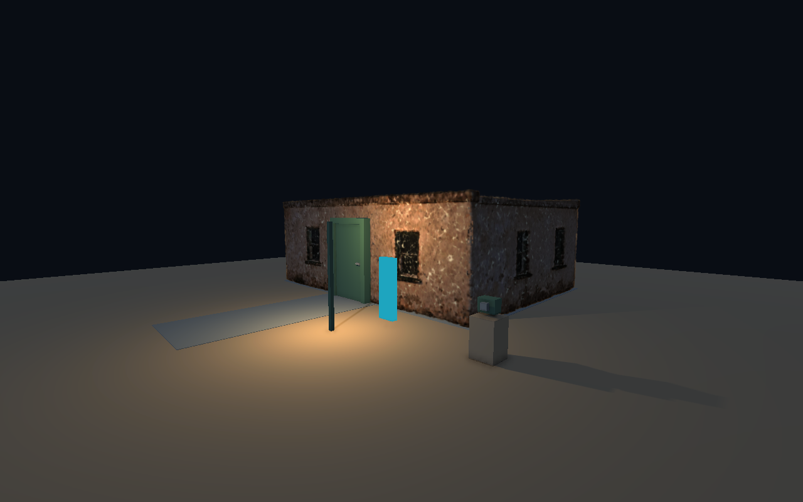

# Hybrid23 — STATION 01 med generert 3D og UnitySplats

**UnitySplats er gratis, MIT-lisensiert og tillater kommersiell bruk med bevarte notiser. Den virker i vår isolerte Unity/Vulkan-prøve. For denne feltbygningen anbefales likevel den genererte teksturerte modellen som vanlig 3D: den er skarpere, enklere å belyse og billigere å tegne.** Splats beholdes som et avgrenset verktøy for fremtidige skannede/genererte miljøer. [Lisens og undersøkte avhengigheter](LICENSE_AND_COMPATIBILITY.md).

Dette er et faktisk kjørt miljøeksperiment, ikke et nytt ferdig kapittel eller en endring av standardspillet. Hovedspillets `Unity/`, lagring og starter er uendret. WorldCase22 er fortsatt produksjonskandidat, Visual10 standard. Kilde og bevis leveres gjennom [PR19](https://github.com/Tombonator3000/SIGNAL-47/pull/19); GitHub viser faktisk flettestatus.

## Hva som ble laget

Et GPT 2.5-bildeforlegg ble laget gjennom Magnific, og deretter en teksturert Tripo v3.1-modell. Originalen har 20 477 vertices, 33 903 trekanter og én 4096×4096 JPEG-tekstur. Blender 4.5.13 ble brukt til faktisk import, to CPU-renderinger og kontroll av geometri/tekstur.

Modellen ble normalisert til 8×6×2,8 meter og fikk en reell klippet døråpning. Samme avledede mesh med 32 556 trekanter ble både importert som vanlig Unity-geometri og samplet til **150 000 overflatebaserte Gaussians**. Dette er **ikke trent 3DGS, rekonstruksjon fra flere fotografier eller en Marble-verden**. Tripo fant på en ekstra inngang bak og laget ikke interiør; det er dokumenterte begrensninger ved kandidatmodellen.

Vanlig Unity-geometri gir gangflate, vegger, innvendig kledning, roterende dør, lampe og kamerarekvisitt. A/B-bryteren bytter bare den genererte visuelle representasjonen. En siste variant bruker nøyaktig samme mesh som nøytral lysproxy for splats, på et eget lag uten kollisjon. Bildene under kommer fra den faktiske spilleren.

| Vanlig teksturert 3D | Splats med lysproxy |
| --- | --- |
|  |  |

[Bildeforlegg, konsept](Visuals/station01-reference-gpt25.png) · [Blender-render](Visuals/blender-front.png) · [Separat kamerafoto fra Unity](Evidence/proxy-01/hybridprobe-exposure-hybrid-light-on.jpg) · [Original GLB](SourceAssets/station01-tripo-v31.glb) · [Opphav og filhash](asset-provenance.json) · [Konverteringsdata](conversion.json).

## Faktisk verifisert

Alle løp brukte Unity **6000.3.22f1**, URP **17.3.0**, Linux/Vulkan, Intel ARL og **1280×800**, HDR aktivt, **1× MSAA**. Arloopa er låst til `6c0258189a2b124af1282fa9236fd9b6637f1a1a`; Unity.WebP 0.3.22 til `9818db6327e09d399bf4fb84da4ed19f03b565b4`.

| Kjøring | API-kontroller | Runtime-feil | Separate JPEG-eksponeringer |
| --- | ---: | ---: | ---: |
| Syntetisk kontroll, 2521 splats | 13/13 | 0 | 4 |
| Generert bygning uten lysproxy | 16/16 | 0 | 5 |
| Generert bygning med lysproxy og rettet interiør | 22/22 | 0 | 5 |
| Samme spiller fra utpakket sluttpakke/starter | 22/22 | 0 | 5 |

Kontrollene inkluderer faktiske `CharacterController.Move`-kall mot vegg/lukket dør og gjennom åpen dør, samme strålebaserte dørfunksjon som E bruker, faktiske lastede/opplastede splatantall og synlig splatbidrag i kamerabilder. En kontroll uten både mesh og splats hindrer at bare fravær av kildemeshen feilaktig består som splatrendering.

Fotografiene tas med en egen deaktivert kamera-instans, URP-renderforespørsel og RenderTexture, og lagres/dekodes som JPEG. De er ikke skjermkopier eller spillets kanoniske feltfoto. Lysproxyens aktive binding, faktiske `RenderNow`-resultat og identisk posisjon/projeksjon/utsnitt kontrolleres før begge hybridfoto. **Dette beviser bare foto fra samme kamerastilling.** Andre kamerastillinger, MSAA 2× fra hovedprosjektet, andre plattformer og det kanoniske fotoapparatet er fortsatt uverifisert.

Den cyan forgrunnsreferansen har **2414 innvendige piksler og null endrede piksler** ved mesh/splat-bytte i begge genererte sammenligninger. Den syntetiske kontrollen har 479 endrede av 2345 cyanpiksler ved foten, hvor de tykke jord-Gaussianene overlapper referansen. Den kontrollen består derfor ikke den automatiske null-overlappsmålingen. Dette er ikke en global godkjenning av overdekking eller en ny kjøring av Splat21s identiske feilsituasjon.

Lysproxyen gir synlig varm/kald respons i fasaden. Den løser ikke den flekkete overflaten eller detaljtapet. Første genererte interiør viste vindusformer og underside gjennom de enkle veggflatene. Vanlige, inntrukne innervegger, gulv og tak fjernet dette i den siste prøven. Noen lyse/takkete skjøter ved tak og hjørner gjenstår. Dette er tilpasset hybridgeometri, ikke en påstått rettelse i rendereren.

Kilde-/spillerhash, rå frametider, originale bilder, JPEG-metadata og kontrollresultater følger hvert [bevissett](Evidence/). Ekte mus/tastatur, blind spillerprøve, ferdig interiør og produksjonsytelse er ikke godkjent av disse API-løpene.

## Kostnad i bildetid

Dette er korte diagnostiske intervaller på to sekunder etter ett sekund oppvarming, uten v-sync. De er ikke en full ytelsestest eller GPU-profileringsmåling, og variantene har ulik visuell kvalitet.

| Sammenligning, lampe på | Mesh, gjennomsnitt / p95 | Splats, gjennomsnitt / p95 |
| --- | --- | --- |
| Generert uten lysproxy | 3,51 / 3,64 ms | 7,31 / 9,63 ms |
| Siste variant med lysproxy | 4,48 / 8,04 ms | 9,82 / 11,69 ms |

Lysproxyen tegner ekstra geometri og et lysbilde. For en modell som allerede finnes som mesh er konvertering til splats ingen automatisk arbeids- eller ytelsesgevinst. En ekte fanget/generert Gaussian-verden kan gi en annen vurdering, særlig for bakgrunn, fjell og store statiske detaljer.

## Lokal prøve og gjentakelse

Den lokale pakken heter `Artifacts/Releases/Hybrid23-b37b22e6eca6/Start-Hybrid23.sh`. Den starter med vanlig mesh; **G** bytter til splats, **F** styrer lokal lampe, **E** døren, **C** tar diagnostisk foto. WASD/mus gir gange/blikk; Escape frigjør markøren. Pakken har separate lagringsfiler og følger med kopierte MIT/BSD-notiser. Den er ikke publisert som spillutgave.

Linux-starteren krever systemd-brukersesjon og Vulkan/compute. Den bruker 2 GiB minnegrense og 15 minutters manuell tidsgrense; automatiske løp har 120 sekunders ytre grense og 90 sekunders intern frist. Én Unity-/Blender-prøve kjøres om gangen. [Pakkeidentitet](Evidence/package-result.json). Alle 186 pakkefiler er hashkontrollert etter utpakking; samme starter består de 22 kontrollene med fem nye kameraeksponeringer. [Verifisert utpakket kjøring](Evidence/packaged-01/verification.json).

For å gjenta fra kilden, bruk den fastlagte Blender-/Unity-versjonen og rene kloner av de to pinnede pakkene. Fra reporoten:

```bash
bash Automation/Splat21/bounded.sh 4294967296 180 /path/to/blender -b --threads 4 \
  --python Automation/Hybrid23/convert_generated.py -- \
  Docs/Research/Hybrid23/SourceAssets/station01-tripo-v31.glb Artifacts/Hybrid23/converted-new
python3 Automation/Hybrid23/prepare.py \
  --package-repo Artifacts/Hybrid23/Upstream/UnitySplats \
  --webp-repo Artifacts/Hybrid23/Upstream/unity.webp \
  --webp-revision 9818db6327e09d399bf4fb84da4ed19f03b565b4 \
  --output Artifacts/Hybrid23/repeat/Unity \
  --ply Artifacts/Hybrid23/converted-new/station-surface-splats.ply \
  --mesh-baseline Artifacts/Hybrid23/converted-new --source-coordinates RUF --proxy-relighting \
  --data-origin 'Magnific Tripo v3.1 generated mesh; deterministic untrained surface Gaussians; no Marble world'
bash Automation/Hybrid23/build.sh Artifacts/Hybrid23/repeat/Unity Artifacts/Hybrid23/repeat/build-01.log
bash Automation/Hybrid23/run.sh Artifacts/Hybrid23/repeat/Player/Hybrid23.x86_64 vulkan Artifacts/Hybrid23/repeat/evidence-01
```

Sett `UNITY_EDITOR` hvis installasjonen ligger et annet sted. Verifikasjonsskriptet trenger Pillow/NumPy; bildene analyseres uten endring. Utelat `--proxy-relighting` for varianten uten lysproxy, eller utelat PLY/mesh-argumentene for den originale syntetiske kontrollen. Nye utmapper og logger kreves for å bevare tidligere bevis.

## Feil som ble funnet og rettet

WebP/streaming-koden krevde den innebygde UnityWebRequest-modulen. En tvetydig byte/int-overload ble rettet. Headless-bygg opprettet ikke UnitySplats’ lazily initialiserte Resources-innstillinger; builderen oppretter og validerer nå de faktiske shader-/materialreferansene. Importvalgene var heller ikke blitt lagret: Spark/Auto stod igjen i metadata. Nå lagres og gjenleses Uncompressed/RUF eksplisitt, med kontroll mot det faktisk importerte assetet.

Ett bygg ble stoppet av prøvens **4 GiB cgroup-grense** under shader-kompilering. To samtidige Unity-jobbarbeidere fullførte senere bygg innenfor samme grense. Det var en avgrenset byggprosess som ble drept; dette er ikke dokumentasjon på et nytt globalt systemkrasj. Lokale originallogger er bevart; de publiserbare loggkopiene fjerner maskin-/sesjonsidentifikatorer med [registrerte originalhash](Evidence/build-log-provenance.json). Tidligere loggkopier og runtime-feilen er bevart i [failed-attempts](Evidence/failed-attempts/).

## Beslutning for videre produksjon

Bruk bilde → generert modell → Blender-kontroll → vanlig Unity-geometri til feltbygninger og nærinteraksjoner. Behold dører, gangflater, lommelyktområder og fotograferbare bevis som kontrollerbar geometri. UnitySplats kan beholdes som gratis eksperimentverktøy for et senere avgrenset landskap med en egnet faktisk Gaussian-kilde.

Marble ba om innlogging, og ingen World Labs-konto ble tilgjengelig i denne kjøringen. Den konkrete **GPT-bilde → Marble-verden**-delen er derfor uutført. Ingen konto eller betaling ble opprettet. GPT/Magnific/Marble har egne tjenestevilkår og kreditter; MIT-lisensen gjør ikke hele kjeden gratis. Når en faktisk verden kan eksporteres, gjenbrukes samme kollisjons-, kamera-, overdekkings- og ytelsesprøve før eventuell hovedspillintegrasjon.

De gjenbrukbare erfaringene er også lagret i [game-production-skillens splat-referanse](../../../Automation/Skills/game-production/references/splats-and-generated-characters.md), med lik lokal skillkopi.
