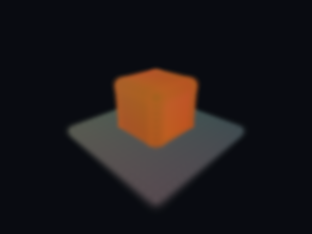

# ProductionTools20 — PlayCanvas, splats og arbeidsflyt

13. september 2026. Basert på hovedgren etter flettet PR15 (`524c56d0f446cdc757cf541c390d24963c3698f7`). Brukerens bestilling: undersøk PlayCanvas og Tripo-artikkelen, vurder Gaussian splatting og fjern unødvendige stoppunkter i skills/instruksjoner.

## Beslutning for SIGNAL / 47

**Ja, Gaussian splatting kan være nyttig, særlig til statiske miljøreferanser og et avgrenset miljøeksperiment.** Første aktuelle motiv er et lite parti stein/terreng eller et forlatt rom som vi har lov til å skanne. Dette er et forslag til produksjonsmetode, ikke ny kanon eller en implementert funksjon. For telefonen, bevegelige radioteleskoper og andre presise interaksjoner beholder vi ordinære Blender-meshes. Arbeidet med spillets dokumenter/P04 trenger ikke vente på dette eksperimentet.

[PlayCanvas-organisasjonen](https://github.com/playcanvas) omfatter webmotor, editor og verktøy rundt splats. SuperSplat og SplatTransform kan brukes i en separat asset-arbeidsflyt; en overgang fra Unity er ikke nødvendig. For et senere nettleserprosjekt er PlayCanvas en aktuell motor å vurdere mot det prosjektets krav.

[SuperSplat](https://github.com/playcanvas/supersplat) er relevant for visuell opprydding og avgrensing av et opptak. [SplatTransform](https://github.com/playcanvas/splat-transform) er prøvd lokalt nedenfor. Automatisk [kollisjonsgeometri](https://developer.playcanvas.com/user-manual/splat-transform/collision/) finnes, men må kontrolleres mot spiller og interaksjoner. PlayCanvas har også [relighting via en belyst støttemodell](https://developer.playcanvas.com/user-manual/gaussian-splatting/building/relighting/); dette er ikke automatisk rekonstruksjon av et rent PBR-materiale. Sistnevnte vurdering er vår tekniske slutning fra metoden.

Den undersøkte [UnityGaussianSplatting-pakken](https://github.com/aras-p/UnityGaussianSplatting) dokumenterer D3D12/Metal/Vulkan og OpenGL-begrensninger. SIGNAL / 47 bruker for tiden OpenGLCore på denne maskinen. Vulkan må derfor prøves i et isolert Unity-oppsett før akkurat denne pakken kan vurderes for integrasjon. At SplatTransform bruker GPU-en her, beviser ikke at Unity-pakken fungerer med vår Unity-versjon og render pipeline.

## Faktisk lokal prøve

Verktøy: `@playcanvas/splat-transform` **3.4.2**, rapportert revisjon `0cb47cd`, Node **24.19.0**. Installert separat i `~/signal47-tools/splat-transform-3.4.2`, uten installasjonsskript. [Versjon/proveniens](tool-provenance.json) og [avhengighetslås](pnpm-lock.yaml) følger rapporten. GPU-valg 0 ble identifisert som Intel Graphics ARL; llvmpipe ble også oppdaget, men ikke valgt.

Testdataene er en original, syntetisk boks og et gulv med **784 splats**. De er ikke fotogrammetri, et AI-generert miljø, et konseptbilde eller et spillbilde. [Kjøreskript](../../../Automation/probe_splats.py) oppretter egne data og nekter å overskrive en eksisterende resultatmappe.

| Kontroll | Resultat og grense |
| --- | --- |
| PLY → SOG på CPU → PLY | PASS: 784 → 784; alle verdier endelige; største toveis nærmeste posisjonsavvik 0,054 mm, under prøvens grense på 1 mm. Dette måler ikke full visuell likhet. |
| Splat-GLB | PASS: faktisk `KHR_gaussian_splatting`, punktprimitive, ingen triangelmesh. Filendelsen alene gir ikke vanlig mesh-kompatibilitet. |
| Voksel/kollisjons-GLB på GPU | PASS: egen ordinær triangelmesh, 515 trekanter etter koordinatretting. |
| SOG-render på GPU | PASS etter retting: inspisert original WebP, 640×480, boks over gulv. Ingen FPS-test. |
| Blender 4.5.13-import | PASS: én mesh, 284 vertices, 515 trekanter; [stråler og mål](Evidence/final/blender-collision.json) bekrefter boks over gulv. |
| Unity-integrasjon, brukerreise, relighting, ekte skannedata og ytelse | UNVERIFIED: inngikk ikke i prøven. |

Første bilde skjulte boksen under gulvet. Kildeinspeksjon i den installerte pakkens `src/lib/utils/math.ts` og `read-ply.ts` (via medfølgende source map) viste at PLY-rom roteres 180° om Z ved overgang til PlayCanvas-rom. Testgeneratoren er rettet til å kode disse aksene. Begge kjøringer er bevart: [før](Evidence/before/verification.json) og [etter](Evidence/final/verification.json). Dette var en feil i vår testgenerator, ikke et dokumentert PlayCanvas-renderproblem.



Kollisjonsmodellen er grov: boksens øverste splatsentre ligger ved 0,77 m, mens strålen treffer proxyen ved 1,0 m. Gulvets splatsentre ligger ved 0,0 m, og proxyen treffes ved omtrent 0,20 m. Prøvens 0,1 m voksler og romlig utstrakte splats gir betydelig volumøkning. **Denne proxyen er ikke godkjent som presis spillkollisjon.** Det er en konkret grunn til å beholde håndlagde kollisjoner på telefon og instrumenter.

Reproduksjon fra repoets rot, med faktiske lokale verktøystier:

```sh
python3 Automation/probe_splats.py \
  --node /path/to/node \
  --cli /path/to/splat-transform/node_modules/@playcanvas/splat-transform/bin/cli.mjs \
  --output /fresh/output/directory

/path/to/blender --background --factory-startup --python-exit-code 1 \
  --python Automation/inspect_splat_collision.py -- \
  /fresh/output/directory/fixture.collision.glb /fresh/output/directory/blender-collision.json
```

## Tripo og gjenbrukbar kunnskap

[Tripo-artikkelen](https://www.tripo3d.ai/blog/gpt-6-astra-3d-character-workflow) gir en nyttig arbeidsdeling: separate kropps-/hode-/hårdeler, sammensetting i Blender og kontroll av rigg, uttrykk og korte bevegelser før større animasjonsarbeid. Dette er leverandørens demonstrasjon; vi har ikke gjenskapt den eller brukt Tripo-kreditter.

En eventuell personmodell i SIGNAL / 47 bør først begrunnes av historien. Samme metode kan vurderes for kandidater fra andre tilgjengelige tjenester når eksport, rigg og rettigheter er kontrollert. Den detaljerte, gjenbrukbare vurderingen er lagret i [game-production-referansen](../../../Automation/Skills/game-production/references/splats-and-generated-characters.md) og i den aktive personlige skillen.

## Instruksjoner og levering

[Skill-gjennomgangen](SKILL_AUDIT.md) dokumenterer 47 undersøkte lokale skill-filer, fem rettede personlige skills, varige arbeidsinstruksjoner og bevarte reelle avhengigheter. Dette passet endrer verktøy og dokumentasjon; det bygger ikke en ny spillutgave. Resources19 er fortsatt siste produksjonskandidat, Visual10 fortsatt standard, med uendrede åpne input-/lyd-/ytelsestester.
