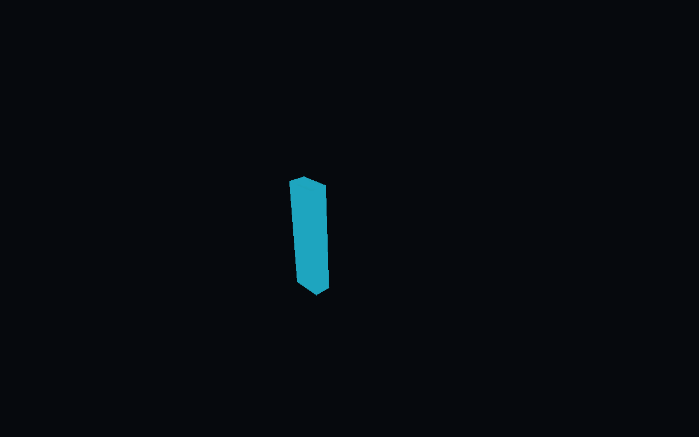
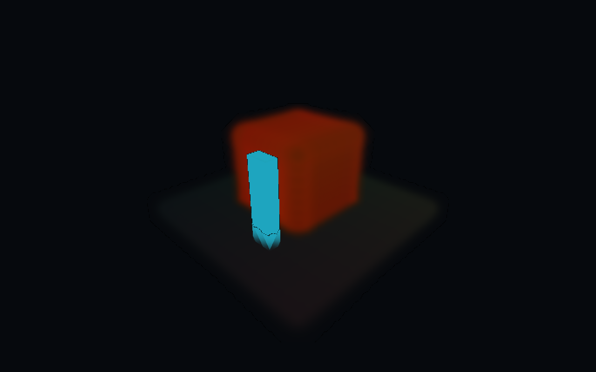
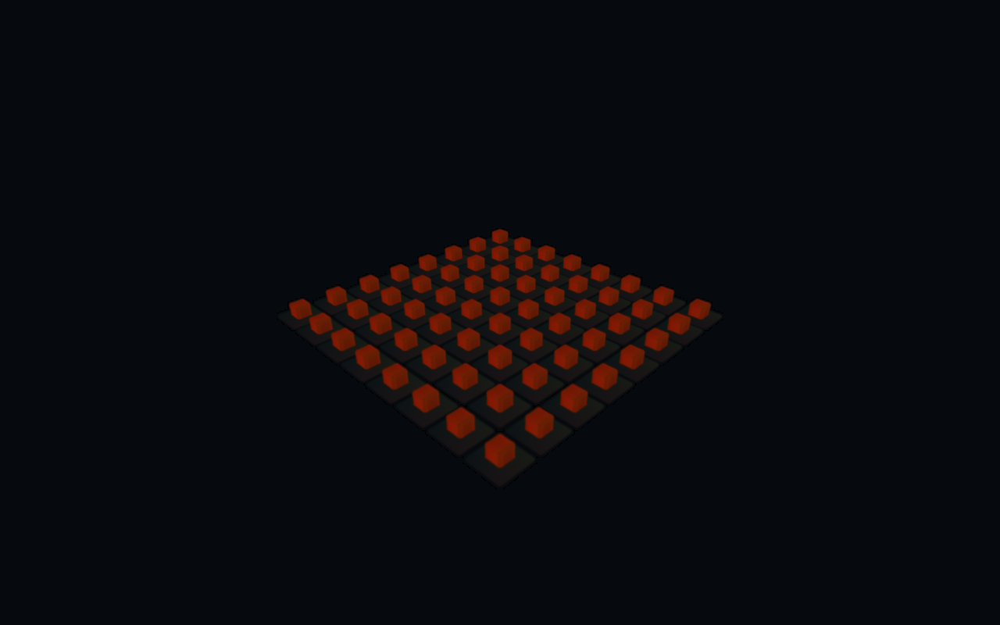

# Splat21 — Unity-prøve og gjenoppretting etter krasj

13. september 2026. Brukerens «Test splatt ekspert» ble tolket som en bestilling av splat-eksperimentet. Etter systemkrasjet er arbeidet gjenfunnet, teststarteren begrenset og Vulkan-prøven fullført på nytt. **Vulkan tegner prøvedataene, men denne integrasjonen er ikke klar for hovedspillet.** OpenGL feilet; blanding med vanlig geometri har en synlig feil også på Vulkan.

Leveringsspor: [PR17](https://github.com/Tombonator3000/SIGNAL-47/pull/17), kildecommit `55320c13378d06e4a5041d3af8d3812e10df677d`. GitHub viser faktisk flettestatus; en merge endrer ikke de åpne testportene.

## Hva var bevart?

PR16 var allerede flettet på `e976fa7f9b46225ed37873131e878bfd87c40dec`. Grenen `experiment/unity-splat-21` hadde bare nye lokale filer under `Automation/Splat21/`; ingen Splat21-commit eller PR var laget. Testprosjekt, to spillerkjøringer og et vellykket bygg lå under ignorerte `Artifacts/Splat21/`. Ingen testprosesser kjørte etter omstarten. Hovedspillets `Unity/` og `Spill-SIGNAL47.sh` er identiske med utgangspunktet.

Resources19 er siste produksjonskandidat og Visual10 fortsatt standard. Designbibelens ramme er 5–6 timer; dette forsøket implementerer ingen ny historie, oppgave eller område. Neste ordinære innholdssteg er fortsatt dokumentlesbarhet/P04.

## Krasjforløp og korrigering

Den gamle OpenGL-kjøringen lagret tre av fire faser, 398 runtime-feil og til slutt exitkode 137. Bildet viser at splats ikke ble tegnet. De nominelle flaggene for compute og støttet shader var likevel sanne. Feilene omfattet ugyldig compute-kernel, divisjon med null og Render Graph-feil. Kjøringen er **FAIL**, og dens frameintervaller er ikke gyldig ytelsesbevis.

Kerneljournalen fra boot `3931e4c5763c46c3baedc827f95ee933` viser 13. september kl. **09:21:07 CEST** global minnemangel (`global_oom`), bare 40 kB ledig swap av 524 284 kB, og at Linux drepte ChatGPT, PID 3650. Ny oppstart er registrert 09:22:12, deretter igjen 09:24:29. Dette bekrefter minnemangel og omstarter, men **fastslår ikke hvilken prosess eller driver som forårsaket hele forløpet**. Exitkode 137 alene fastslår heller ikke hvem som drepte testspilleren. Utdraget er gjengitt som fakta; full systemjournal og lisenslogger er ikke publisert.

Den gamle tidsbegrensningen var ikke tilstrekkelig under systemproblemene. Ny starter avviser OpenGL før prosessstart og kjører bare Vulkan gjennom en kontrollert Linux-brukertjeneste: 2 GiB prosessgrense, ingen swap, maksimalt 60 sekunder og avslutning av hele prosessgruppen. Starteren kontrollerer at minnegrensene faktisk finnes; den har ingen ubegrenset reservevei. Unity-kontrolleren lagrer maksimalt 16 feilmeldinger, teller feil, stanser ved første observerte feil og har en intern frist på 50 sekunder. Disse grensene er ingen garanti mot alle GPU-/driverfeil eller ressursbruk utenfor prosessgruppen.

Seks [tester av starteren](Evidence/guard-tests.json) består med ufarlige erstatningsprosesser: effektive minnegrenser, tidsstopp, OpenGL-avvisning uten start, manglende brukertjeneste uten reservevei, bevart feilstatus og beskyttelse av eksisterende bevis. Runtime-feilavbruddet er kompilert og kildegjennomgått; det er ikke særskilt testet med injisert rendererfeil. OpenGL er ikke startet igjen.

## Prøvens innhold og resultater

| Del | Valg og faktisk kontroll |
| --- | --- |
| Motor | Unity 6000.3.22f1, URP 17.3.0, separat prosjekt med kopierte renderinnstillinger |
| Splatpakke | aras-p/UnityGaussianSplatting 1.1.1, låst til `2c6fed37da67a217367261fcfcd3316d34c73e76` |
| Data | Original syntetisk kasse/gulv: 784 Gaussians; 8×8 kopier: 50 176; FP32 og SH0 |
| Enhet | Intel Graphics ARL, Vulkan, 1280×800, uten vSync/bildefrekvenstak |
| Renderoppsett | Render Graph aktiv, egen URP-feature, HDR, MSAA avslått; hovedspillets MSAA er bevart |
| Bygg | Vellykket etter gjenoppretting, 0 byggfeil; editorens advarsel om to Persistent-allokeringer er bevart i loggutdrag |
| Vulkan før krasj | Fire faser, exit 0, 0 registrerte runtime-feil |
| Vulkan etter korrigering | Fire faser, `completed=true`, exit 0, 0 registrerte runtime-feil |
| OpenGL før krasj | Tre faser, 398 feil, ingen synlige splats, exit 137: FAIL |
| Blanding med vanlig objekt | Synlig feil nederst i ugjennomsiktig cyan referanse: FAIL |
| Hovedspill, skannede miljøer, lys, kollisjon, ekte input | UNVERIFIED; ingen integrasjon eller produksjonsgodkjenning |

Importen roteres 180° om Z for samme koordinatretning som den tidligere PlayCanvas-prøven. Ved første kompilering manglet `XRSettings`: både Unitys XR- og VR-modul ble lagt til **bare testprosjektet**; typen ligger i VR-modulen i denne motorversjonen. De faktisk løste avhengighetene er registrert i [pakkelisten](Evidence/resolved-packages.json), med blant annet Burst 1.8.30, Collections 2.6.8 og Mathematics 1.3.3.

Ny Vulkan-kjøring, to sekunder oppvarming og omtrent fem sekunder måling per fase:

| Fase | Antall splats | Gjennomsnitt, ms | p95, ms | p99, ms |
| --- | ---: | ---: | ---: | ---: |
| Nærbilde, referanse | 0 | 1,695 | 2,487 | 3,186 |
| Nærbilde, splats | 784 | 2,873 | 4,301 | 4,720 |
| Oversikt, referanse | 0 | 1,593 | 2,349 | 2,525 |
| Oversikt, splats | 50 176 | 4,132 | 5,670 | 6,488 |

Dette er korte, ukappede CPU-observerte frameintervaller i en nesten tom prøve, ikke GPU-tider eller lovet SIGNAL / 47-ytelse. Tallene fra før og etter omstarten har ulike systemforhold og viser ikke en dokumentert optimalisering. Alle elleve bevarte fasesammendrag er kontrollert mot originale, ordnede CSV-filer, også de ugyldige OpenGL-målingene.

## Faktiske runtime-bilder

De fire nye Vulkan-bildene er inspisert. De viser syntetiske testdata, ikke et fotogrammetrisk miljø eller et spillområde. Nærbildet viser hvorfor grønn bygg-/loggstatus ikke er tilstrekkelig: splats påvirker nedre del av cyanobjektet som skal dekke bakgrunnen.

| Referanse uten splats | Samme kamera med splats |
| --- | --- |
|  |  |



## Bruk og avgrensning

Anbefaling: behold splats som kandidat for statisk miljøreferanse eller et senere lite bakgrunnsforsøk. Bruk vanlig Blender-geometri til telefon, teleskop, dokumentbord og andre interaktive objekter. Ikke bytt hovedspillets renderer for denne pakken. Dens splats påvirkes ikke av vanlige lys, skygger eller lightmaps; PlayCanvas' separate relighting-løsning følger ikke automatisk med til Unity. Se den [låste integrasjonsdokumentasjonen](https://github.com/aras-p/UnityGaussianSplatting/blob/2c6fed37da67a217367261fcfcd3316d34c73e76/docs/render-pipeline-integration.md).

Et eventuelt neste splat-forsøk må først løse og kontrollere blandingen med ugjennomsiktig geometri, deretter vise et rettighetsklart miljø med relevant lys og kamerabevegelse. Det er en separat framtidig oppgave; den blokkerer ikke P04 eller videre historiearbeid.

Kildepakken er MIT-lisensiert; bevar [opphavsrett og lisens](https://github.com/aras-p/UnityGaussianSplatting/blob/2c6fed37da67a217367261fcfcd3316d34c73e76/LICENSE.md) ved distribusjon. Dette repoet inneholder vår prøve og bevis, ingen tredjepartsskann eller ferdig spillerpakke. Original PLY og dens rettighetsspor ligger i ProductionTools20.

## Gjenskaping og identitet

Kjør fra repoets rot, med den låste, rene upstream-kopien og prosjektets Unity-versjon. Bruk et nytt forsøksnavn; ikke overskriv tidligere kjøringer:

```bash
python3 Automation/Splat21/prepare.py --package-repo /path/to/UnityGaussianSplatting --output Artifacts/Splat21-new/Unity
bash Automation/Splat21/bounded.sh 4294967296 600 /path/to/Unity -batchmode -nographics -quit -projectPath "$PWD/Artifacts/Splat21-new/Unity" -executeMethod Splat21Build.Build -logFile "$PWD/Artifacts/Splat21-new/build.log"
bash Automation/Splat21/run.sh Artifacts/Splat21-new/Player/Splat21.x86_64 vulkan Artifacts/Splat21-new/vulkan-01
python3 Automation/Splat21/test_guards.py
```

Grafisk kjøring trenger fungerende lokal XWayland-tilgang og Linux-brukertjenester med minnekontroll. Skriptene låser ikke opp skjermen eller sender tastatur-/museinput. Etter krasjet ble det eksisterende isolerte prosjektet gjenbygd innenfor 4 GiB/600 sekunder. En ny forberedelse ble i tillegg kontrollert for identiske C#-/PLY-filer og samsvarende avhengighetsversjoner; det nye prosjektet ble ikke separat gjenbygd.

[Verifikasjon og kilde-/spillerhash](Evidence/verification.json) knytter de to historiske kjøringene til den bevarte gamle spilleren og den nye kjøringen til den korrigerte spilleren. Historisk C# er lagret som tekstbevis, ikke som anbefalt kjørbar oppskrift. Fullstendige lokale bygg/logger og begge spillerne ligger i `Artifacts/Splat21/`. Ingen ny spillutgave eller endring av standardstarteren er levert.
