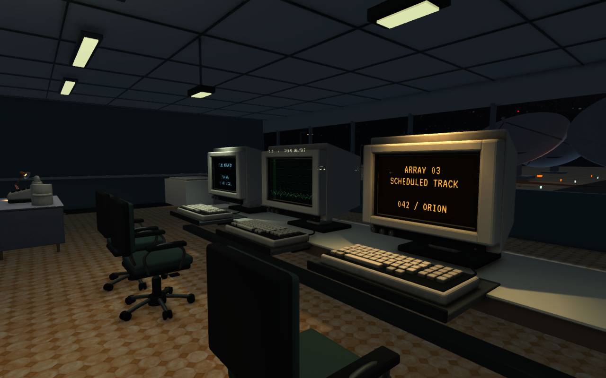

# Workstation18 — originale Blender-modeller i kontrollrommet

Tre originale modeller er integrert på de tre arbeidsplassene i hovedscenen: CRT, tastatur med uttrekkshylle og arbeidsstol. Spilleren bruker fortsatt de samme instrumentene til å kalibrere, avvise interferens og låse signalet. Dette er et visuelt pass på den eksisterende undersøkelsen, ikke et nytt kapittel.

Retningen følger den godkjente [VotV-vurderingen](../Research/VOTV/README.md): tydelige instrumenter, troverdig støtte og materialfamilier, med SAROs egne modeller og Unity/Blender-stack. Modeller, font eller spillkode fra VotV er ikke importert. Den eksisterende paletten og de samme skjermflatene er videreført.

## Visuelt resultat

[Før: arbeidsplassen](Evidence/before-workstation.png) · [Før: CRT](Evidence/before-crt.png) · [Etter: arbeidsplassen](Evidence/02-workstation.png) · [Etter: CRT](Evidence/03-crt-detail.png)



Bildene i sluttsettet er uendrede skjermfangster fra den utpakkede Linux-kandidaten i 1280×800. Kamera og tilstand er satt gjennom API. De dokumenterer synlig resultat og testtilstander, ikke en fysisk mus-/tastaturreise. Førbildene kommer fra hovedscenen bygget før passet; kameraene for arbeidsplassen og CRT-detaljen er de samme.

[Forfra i Blender](Evidence/front-authoring.png) og [bakfra i Blender](Evidence/rear-authoring.png) viser modellene i nøytral studiobelysning. De er authoring-renderinger. CRT-modellen inneholder huset; den levende skjermflaten kobles til i Unity og er derfor ikke med i Blender-renderingen.

## Endringer og avgrensning

| Modell | Synlig endring | Trekanter | Mesh-renderere |
|---|---|---:|---:|
| CRT | Avrundet ramme, indre skjermkant, avsmalnet bakkasse, betjeningshjul, ventilasjon og sokkel | 7 344 | 5 |
| Tastatur | Egen innfatning, avrundede taster, mellomromstast, høyre tallblokk, kabel og understøttet uttrekkshylle | 13 544 | 5 |
| Stol | Polstret sete/rygg, rørarmer, høydehendel, femarmet understell og doble hjul | 10 844 | 3 |

Ni instanser gir totalt 95 196 trekanter og 39 mesh-renderere. Dette er geometritelling, ikke målt draw-call-kostnad eller FPS. Ved første installasjon ble 270 tidligere aktive renderere skjult. De eldre modellene er bevart i prosjektet og scenen. De tre aktive skjermflatene, signalprofilene, 154 eksisterende kollisjonskomponenter og to lightmaps er beholdt. Kollisjonsformene er ikke utvidet til hver tast, hjul eller hendel; dette er kosmetiske modeller med eksisterende interaksjonsvolumer.

Ingen endring i signalverdier, 47-sekunderssekvens, lagringsformat, originalfoto, lydmiks eller standardstarter. Bakt lys er bevart; dette er ikke en ny lysbaking. Tastene og stolens hendel har ingen nye separate handlinger.

Redigerbar kilde: [SIGNAL47_workstation18.blend](../../Unity/Blender/SIGNAL47_workstation18.blend). Oppskrift: [workstation18.py](../../Unity/Blender/Source/workstation18.py). [Kildemanifestet](../../Unity/Assets/Signal47/Art/Workstation18/source-manifest.json) angir mål, geometri og eksportkontroller. Unity-integrasjonen ligger i [Workstation18.cs](../../Unity/Assets/Signal47/Editor/Workstation18.cs) og er også koblet inn i sceneoppskriften for senere regenerering.

## Inspeksjon og korrigering

Førbildet viste tastaturer med stort overheng uten synlig støtte. Det nye tastaturet har en hylle med skinner som går tilbake under bordet. Første Unity-inspeksjon avdekket at tallblokken lå til venstre; [første kandidat](Evidence/iteration1-keyboard.png) er bevart, og sluttmodellen har tallblokken til høyre fra spillerens plass.

Den nye API-testen hadde to tidsantakelser som måtte rettes. Den kontrollerte først telefonen før den etablerte forsinkelsen på 3,6 sekunder var utløpt. Deretter leste den regissørens sluttilstand samme frame som antennene meldte ferdig, før regissørens korutine hadde behandlet resultatet. [Det mislykkede andre testresultatet](Evidence/iteration2-test-race.json) er bevart. Testen venter nå på de faktiske overgangene, med en separat tidsfrist; spillsekvensen ble ikke endret for å få testen grønn.

Dette er sekvensiell egenkontroll. Ingen uavhengig reviewer eller blind førstegangsspiller inngår.

## Verifikasjon og pakke

[Verifikasjonsrapporten](Evidence/verification.json) knytter testene til kilde, bygg og pakke. Den omfatter eksport/reimport av tre modeller, importkontroll av ni Unity-instanser, signalsekvens, lagring/gjenoppretting og originale foto. Sluttbildene dekker rom, arbeidsplass, stol, levende CRT, åpen konsoll og låst signal.

| Kontroll | Faktisk resultat |
|---|---|
| Blender eksport/reimport, mål, UV og flateareal | PASS, tre modeller |
| Unity-import, mål, normaler, UV og geometritelling | PASS, ni instanser |
| Signalsekvens i faktisk spiller | PASS, 19 API-kontroller direkte og 19 gjennom nyutpakket starter |
| Lagring, avbrytelse, feil og gjenoppretting | PASS, 50 eksisterende API-kontroller gjennom nyutpakket starter |
| Originalfoto | PASS, begge JPEG-er dekodet og byteidentitet bevart; historisk kildeprofil også uendret |
| Visuell kontroll | PASS for modellpassets kriterier, seks uendrede runtime-bilder i 1280×800 |
| Arkiv og utpakking | PASS, 173 filer, kontrollsummer, stier, moduser og kjørerettigheter |

Modell-/integrasjonscommit: `f92db83`. Unity-kildehash: `ae3fe61bf1903bec8c2978cf6b6a413b3eb82b54bb15eae1c5798dacf60d5e0c`. Bygget ble laget før commit, med innholdshash som identitet; senere dokumentasjon endrer ikke denne kilden. Verifikasjonen er kjørt lokalt med Unity 6000.3.22f1, OpenGLCore og Mesa Intel Graphics (ARL), ikke som GitHub CI.

Native mus/tastatur, andre skjermstørrelser, subjektiv lydvurdering og ny ytelsesmåling er fortsatt UNVERIFIED. Tidligere Visual10-målinger gjelder ikke denne kandidaten. Blindtesten av P04/P05, integrasjon av arkivoppgaven og det samlede 5–6-timersmålet er også åpne.

Fra reporoten åpnes kandidaten med:

```bash
Artifacts/Releases/Workstation18-ae3fe61bf190/Start-SIGNAL47.sh
```

Flyttbar lokal pakke: `Artifacts/Releases/SIGNAL47-Workstation18-ae3fe61bf190-Linux.tar.gz`. Den er merket TESTKANDIDAT. `Spill-SIGNAL47.sh` starter fortsatt Visual10. Pakker under `Artifacts/` følger ikke med et rent Git-klon.

Reproduksjon med installert Blender og Unity:

```bash
/home/tombonator3000t/signal47-tools/blender-4.5.13-linux-x64/blender --background --python-exit-code 2 --python Unity/Blender/Source/workstation18.py
bash Automation/build-workstation18-linux.sh
bash Automation/run-workstation18-checks.sh
python3 Automation/package-chapter09.py --label Workstation18 --candidate
```

Ny bygging identifiseres fra faktisk kildeinnhold. Eksisterende pakker skal ikke overskrives med andre bytes. Pakkekontrollens navnevalidering er oppdatert slik at den godtar de samme kandidatfamiliene som pakkeskriptet.

Neste avgrensede arbeid er dokumentlesbarhet og en avklart kobling mellom den eksisterende instrumentruten og P04. Modellene er nå i hovedrommet; den selvstendige arkivprøven er fortsatt separat. Lydmiks bør vurderes i et eget faktisk lyttpass.
