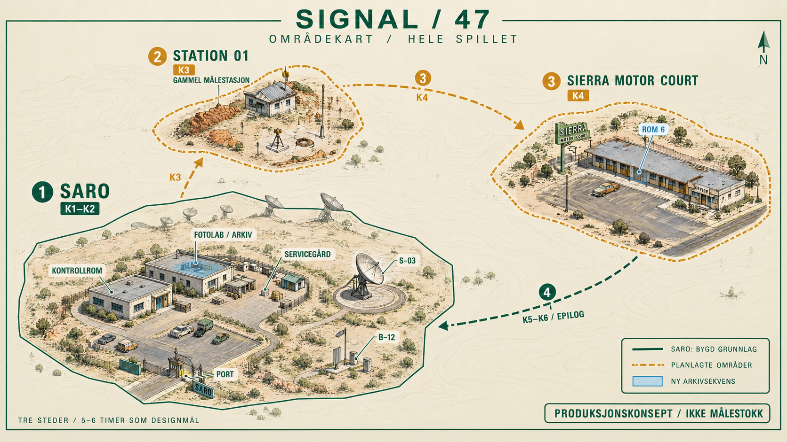

# WorldCase22 — sammenhengende arkivsak og hele verdenskartet

13. september 2026. Brukeren ba om større leveranser, subagenter og et områdekart som bilde. WorldCase22 knytter den tidligere arkivprøven til **hovedspillets faktiske B-12-sak**, med fire kilder, to påfølgende undersøkelser og varig framdrift. Kartet og [det samlede verdensdesignet](WORLD_DESIGN.md) gir en konkret ramme for de resterende områdene.

## Spilleren kan nå

Etter å ha levert rapporten fra de to eksponeringene, går spilleren til mappen **STATION 01 / ARCHIVE DOSSIER** på fotolabens arkivbenk, sør for lysbordet. Et nytt mål peker dit. Mappen er synlig tidligere, men forklarer da at B-12-rapporten må leveres først.

Fire kildekort kan leses i valgfri rekkefølge: original protokoll, korrigert kopi, B-12s vedlikeholdskort og arkivindeks. P04 krever at spilleren sammenligner begge protokoller og dokumenterer at referanse C ble fjernet og funnet omforklart. P05 krever vedlikeholdskortet og indeksen, samt samsvarende sted, STATION 01 og trekant med strek. Begge kilder beskriver nå merket selvstendig. Ubegrunnede skyldpåstander, feil markør og −39 LY som årskode avvises med konkret tilbakemelding og kan prøves på nytt.

Delvis lesing og begge funn følger den vanlige saken gjennom lagring, Fortsett og Previous Shifts. Et bekreftet funn er ikke automatisk et ferdig lagret checkpoint; sluttpanelet viser faktisk lagringsstatus. Originale fotografier endres ikke. E08 er et tydelig merket indeksdiagram, ikke et historisk negativ som allerede er produsert.

Dette implementerer P04/P05-kjeden ved eksisterende arkivbenk. Det bygger ikke det senere, separate arkivrommet, historiske negativer, Nora-møtet, transporten eller STATION 01. Sluttpanelet opplyser at neste område ennå ikke kan besøkes. Hele K2 og designbibelens 5–6 timer er derfor ikke ferdig eller målt.

## Områdekart for hele spillet

[Åpne kartbildet](Visuals/world-map-final.png). Det viser tre steder og ruten SARO → STATION 01 → SIERRA MOTOR COURT → SARO, med kapitteltilknytning. Grønt viser eksisterende SARO-grunnlag, rav viser planlagte områder og blått markerer den nye arkivsekvensen. Arkitekturen er skjematisk illustrasjon, ikke en gjengivelse av Unity-modellene eller et målfast nivådesign. B-12 ligger sør for S-03 og er vist som optisk referanse, uten radioteleskop.

Det forespurte navnet «Imagen 2.5» fantes ikke i den tilkoblede katalogen. Første kart ble laget med **GPT 2.5 i Magnific**, deretter korrigert med det innebygde bildeverktøyet: SARO-kuppel fjernet, B-12 rettet og norske bokstaver korrigert. Den innebygde redigeringens modellversjon er ikke eksponert. [Proveniens](Visuals/provenance.json), [første prompt](Visuals/map-prompt.txt), [redigeringsprompt](Visuals/map-edit-prompt.txt) og [første utkast](Visuals/world-map-gpt25.png) er bevart. Sluttbildet er 1672×941; førsteutkastet er 3840×2160. Ingen oppskalering er påstått.

Kartet er et produksjonskonsept med framtidige steder; det vises ikke i spillerens dossier og avslører dermed ikke senere historie der. [map-spec.json](map-spec.json) er den maskinlesbare planen. Verdensdesignet beholder tre områder, seks interiører som innholdstak, 18 hovedoppgaver og et **330-minutters designmål**. Dette er ingen måling av implementert spilletid.

## Samarbeid og korrigerte funn

Tre subagenter arbeidet parallelt med verdensdesign, P04/P05-kontroller og verifikasjon. Integrasjon, faktisk bygg/kjøring og bildekontroll ble utført av hovedagenten. Subagentene utførte kode-/designgjennomgang; ingen påstås å ha spilt en blindtest.

Funnene ble rettet før sluttkandidaten:

- Første kompilering av testen traff navneskygging mot `Signal47.Environment`; den eksplisitte systemreferansen retter dette.
- Mappen lå 54 mm over bordet. Plasseringen bruker nå faktisk bordflate +1,5 mm; måling og nærbilde kontrollerer kontakten.
- Verdensetiketten gikk utenfor mappens papirfelt. Den tilpasses nå det importerte feltets faktiske størrelse.
- HUD-tekst ble tegnet over dokumenttittelen til tross for grønn API-status. Dossieret eier nå hele skjermen mens det er åpent.
- Ved 1600×900 ble trekantmerkets skråstreker tegnet utenfor indeksfeltet selv om alle API-kontroller bestod. Strekene bruker nå samme logiske koordinatsystem før skjermskaleringen; ny kjøring og originalbilder kontrollerer rettelsen.
- Vedlikeholdskortet ba om samsvar med et merke uten å beskrive sitt eget merke. Kortet beskriver nå samme trekant med strek som arkivindeksen.
- Gjenoppretting med manglende foto kunne gjøre den opprinnelige saken ufullført mens arkivfunnene bestod. En ny eksplisitt `worldCasePhotoRecovery`-markør bevarer funnene og tillater videre lagring under reparasjonen. Arkivet forblir låst til originalsaken igjen er fullført. Vanlig ulovlig kombinasjon av framdrift og ufullført kapittel avvises fortsatt.

## Verifikasjon og levering

Endelige kjøringer, pakkeidentitet og åpne porter registreres i [verifikasjonen](Evidence/verification.json). [Testplanen](TEST_PLAN.md) beskriver hva API-kjøring kan og ikke kan bevise. Bruk en separat kandidat, og behold Visual10 som standard til de åpne bruker-/ytelsesportene er kontrollert.

Sluttkandidat: `Artifacts/Releases/WorldCase22-5c453a898fce/Start-SIGNAL47.sh`. Kildehash: `5c453a898fce7d670d866204ef2102231acf4d8096b1860e24b43903dde68a16`. Spillpakken er lokal; kode, kart og bevis følger repoet.

| Faktisk kontroll | Resultat |
| --- | --- |
| Arkivreise direkte, 1280×800 | 118 bestått |
| Arkivreise fra utpakket starter, 1600×900 | 118 bestått |
| Eksisterende spillfunksjoner, samme utpakkede starter | 42 bestått |
| Meny og gjenoppretting, samme utpakkede starter | 50 bestått |
| Pakkefiler og identitet | 173 filer verifisert |
| Originale runtime-bilder | 13 per oppløsning kontrollert |

Begge originalfoto, historisk kildesak og standardstarter er uendret. En første pakke med kilde `a0bd27d0ccb1` er erstattet av sluttkandidaten over etter at større oppløsning avdekket indeksfeilen; de lokale forsøksfilene er bevart som historikk.

Bygg fra prosjektets gjeldende kilde med `bash Automation/build-worldcase22-linux.sh`. Den åpner den bevarte hovedscenen og legger til arkivfunksjonen; den regenererer ikke basescenen eller lysbaker på nytt. Originale 154 kollidere og to lightmaps beholdes; én ny interaksjonskollider tilkommer. Unity 6000.3.22f1, URP 17.3.0, Input System 1.20.0, radio-/tidskonstanter og original Blender-folio beholdes. Splatpakken inngår ikke i hovedspillet.

`bash Automation/run-worldcase22-checks.sh` oppretter en ny disponibel profil, kopierer en historisk fullført sak og flytter kun referanser til kopierte fotofiler. Den kjører en ekte Unity-spiller med API-styrte handlinger og faktiske scenegjenlastinger, uten å sende tastatur-/museinput. Den bruker minne-/tidsgrenser og felles kjørelås. Standard spillerprofil og kildefoto brukes aldri som skrivemål.

Ekte gange/tastatur/mus, blind forståelse og tidsbruk hos en ny leser, subjektiv lyd og separat ytelse er fortsatt **UNVERIFIED**. Kartet lukker ingen av disse portene.

## Neste større produksjonsleveranse

Bygg **hele den første feltreisen til STATION 01** som en sammenhengende produksjon: trygg avreise/retur med sakstilstand, én feltbygning, den historiske oppstillingen og fastmerkene, kontrollert lampetest, kabelsløyfe/kutt, nødvendige ekte feltfoto og begrunnet videre spor. K3s P06–P09 og gjenstart på tvers av området bør behandles samlet, ikke som separate kosmetiske pass. Dette er neste leveranse, ikke allerede implementert innhold. Den samlede rekkefølgen videre til motellet, SARO-retur, finale og epilog er beskrevet i verdensdesignet.
