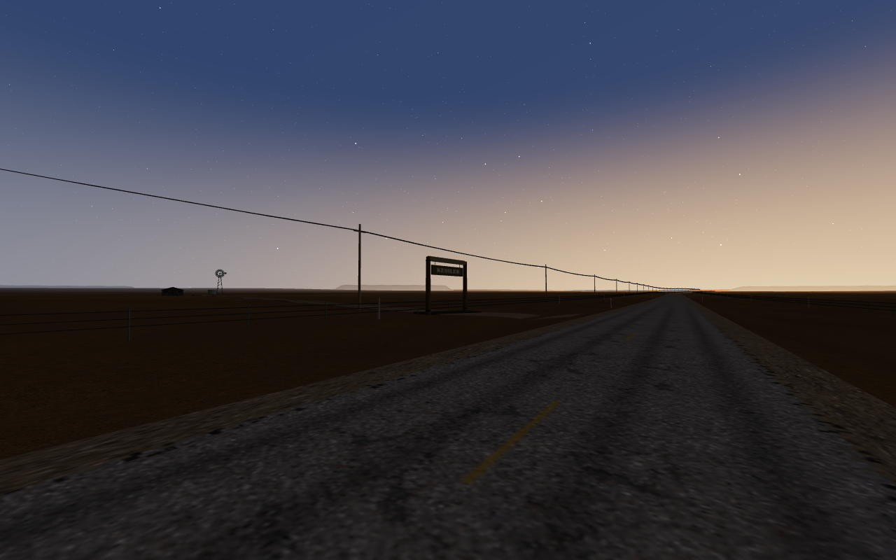
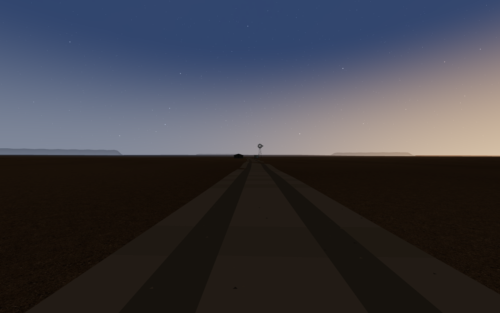

# Kessler ved mile 3,2

Avgrenset bestilling fra Claude, melding 86 i den avtalte økten 6. oktober 2026. Grunnlag: main `bebd81d`. Tom har autorisert avgrenset kode og løpende samarbeid. Det nye landemerket kan tas bort hvis Tom ikke ønsker det.

`src/drive/oldRoadLandmarks.ts` eksporterer `LandmarkContext` og `buildLandmarks(c)`. Modulen bruker bare innsendt `beside`, `heightAt`, `sAt`, `rnd` og `std`. Den endrer ingen runtime-tilstand, lysplasser, gjerder, spillkonstanter, historiehendelser eller aktive Claude-filer.

| Felt | Kontrakt |
|---|---|
| `group` | Veilokal gruppe. Opphav ved `beside(sAt(3.2), -17)`, y = 0; interne x/z-verdier relativt til gruppen. Legges direkte under OldRoad-gruppen. |
| `obstacles` | Veilokale sirkler for portstolper, vindmølle og tank, og boks for huset. Alle utenfor asfalten. Claude oversetter med veiens opphav ved innkobling. |
| `fenceGaps` | Ett venstre gap, side `-1`, fra `sAt(3.2)-3.85` til `sAt(3.2)+3.85` meter. Claude åpner gjerdet. |
| `glints` | Én veilokal `THREE.Vector3` under husets gårdslampe. Bruk et lite, konstant varmt glødepunkt. Ingen flomlysplass eller ekte lampe reserveres av modulen. |

Porten har to tømmerstolper og tverrbjelke. KESSLER skrives på begge sider av den hengende planken med lokal 512 × 128 CanvasTexture. Det er den eneste teksten. Feristen ligger i innkjørselen, og et fem meter bredt grusspor følger terrenghøyden 300 meter nordover fra porten. Ved enden står en statisk vindmølle, vanntank og et mørkt våningshus med mørke vinduer og ett gårdslys. Ingen mennesker eller trafikk.

Alle former er original, parameterstyrt geometri for SIGNAL / 47, bygd med prosjektets Three.js- og kit-hjelpere. Ingen nedlastede modeller, kopierte spillassets eller nye rasterfiler. Fargeflatene samles til ett vertexfarget mesh; skiltets to tekstsider samles til ett mesh. Gårdslyset kan inngå i det eksisterende glødepunktmeshet, eller koste ett separat tegnekall i forhåndsvisningen.

Veiens grove bakkeplan ligger rundt én meter under `heightAt` utenfor den 260 meter brede terrengstripen. Modulen kompenserer med grusskuldre som går ned i bakken, og nedgravde ben/fundament. Dette bevarer høydekontrakten og kontakt med faktisk synlig terreng uten endringer i veiens geometri.

Forhåndsvisningen bruker faktisk OldRoad og Sky ved 05:24, men er en isolert modulkontroll. Den kobler ikke landemerket inn i vanlig spill. Det eksisterende gjerdet er ennå ikke åpnet. Testene og innkoblingen i `OldRoad.ts`, `oldRoadLayout.ts`, `World.ts` og historien tilhører Claude.

Claude har bekreftet én samlet integrasjonsrunde etter levering: `chapter6.py`, `drives.py`, innholdspolicy og Pages-bygget fra undermappe. Modulkontroll og stillbilder bekrefter ikke manuell kjøring, lyd, ytelse på ekte maskinvare eller publisering.

## Kontrollbevis

- `report.json`: faktisk Chromium/SwiftShader-fangst, 1280 × 800, 05:24, med kildefil- og bildehasher. Begge utsnitt har 13 av 13 struktursjekker PASS. Gjenoppbygging/opprydding har 14 av 14 PASS, inkludert 3 geometrier, 3 materialer og 2 teksturer disponert én gang. Ingen registrerte konsoll-, side- eller HTTP-feil.
- Modulen har **2 mesh, 2 materialer, 6 172 trekanter og 2 tegnekall**. Forhåndsvisningens eget gårdslys legger til ett tegnekall. Hele forhåndsvisningen viser 27/23 tegnekall i vei-/innkjørselutsnittet. Dette er ikke målinger av kapittel 6 med lastebil.
- Gateplassering er nøyaktig `beside(sAt(3.2), -17)`. Den inverse nærmeste-veiprojeksjonen bruker 4 meter segmenter og avviker 0,121 meter i s her; kontrolltoleranse 0,25 meter. Sideavviket er under 0,03 meter. Hele hindringene er utenfor asfalt.
- `terrain_review.json`: uavhengig geometrikontroll mot faktisk indeksert OldRoad-terreng PASS. Alle 404 ytterkant-/nordkappepunkter går minst 1,34 meter under bakken; verandaføttene minst 1,13 meter. Vindmølleben og tank-/husfundament er nedgravd. Skulder- og kappnormaler peker opp, alle attributter er endelige, og hele hindringsformene ligger utenfor asfalten. Reproduser med `node tools/landmark_terrain_check.mjs /tmp/kessler-terrain.json`; kontrollen bruker faktiske terrengtriangler, med rasterlasting og Canvas stubbet.
- Typecheck, Python-syntaks, avvisning av opptatt evidensmappe og motstridende CLI-valg: PASS. Tidligere uendrede spilltester gjenbrukes; nye tunge spilltester utføres av Claude etter innkobling.
- Bildene er inspisert som isolerte Three.js-forhåndsvisninger. KESSLER og porten er lesbare fra veien; sporet leder til det mørke huset og vindmøllens silhuett. Gårdslyset er lite på 300 meters avstand. Ingen synlig løsrivelse av sporets slutt eller konstruksjoner fra bakken i de to utsnittene. Nærinspeksjon av gården, kjøring, lyd og ekte maskinvareytelse er UNVERIFIED.

Reproduser i en ny eller tom mappe: `python3 tools/landmarkpreview.py --capture /tmp/kessler-preview`. Krever prosjektets Node/Three.js-avhengigheter og Playwright med Chromium. Startverktøyet og bildene er utenfor vanlig spillinngang og bygget.
